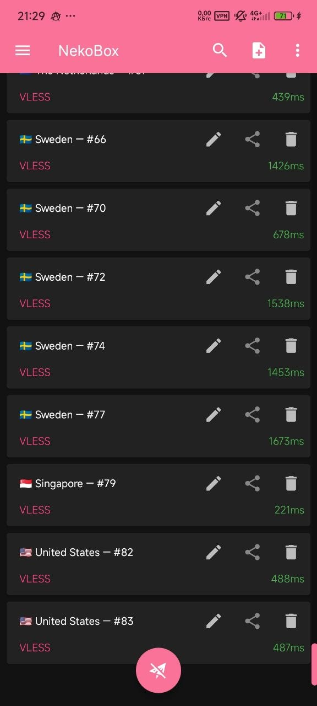
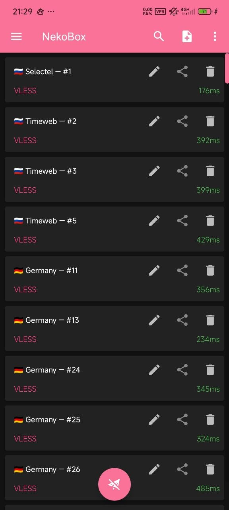
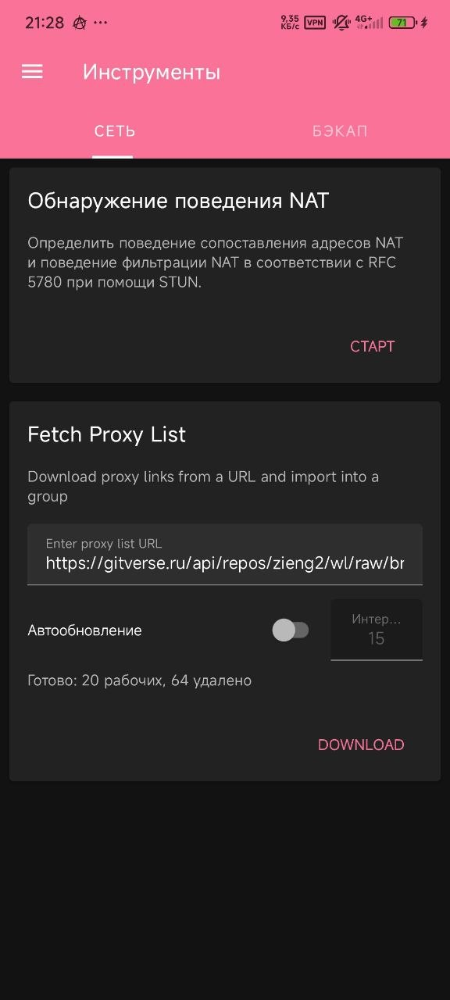

# NekoBox for Android — Mod (WL Auto-Fetch)

**Модификация** [NekoBox for Android](https://github.com/MatsuriDayo/NekoBoxForAndroid) с автоматическим обновлением белых списков (whitelist) для обхода блокировок в РФ.

Списки прокси берутся из проекта **[zieng2/wl](https://github.com/zieng2/wl)**.

---

## Что добавлено (Mod Features)

Все функции мода доступны в разделе **Инструменты** (Tools):

| Функция | Описание |
|---|---|
| **Fetch Proxy List** | Автоматическая загрузка и импорт прокси-серверов по URL |
| **Автообновление** | Автоматический фетч и обновление списка через заданный интервал (минуты) |
| **Auto-refresh** | Автоматическая проверка и удаление нерабочих серверов |

### Как пользоваться

1. Откройте **Инструменты** (Tools) — вкладка **Сеть**
2. В поле URL уже предзаполнен адрес: `https://gitverse.ru/api/repos/zieng2/wl/raw/br`
3. Включите **Автообновление** и задайте интервал (например, 15 минут)
4. Нажмите **DOWNLOAD** — список загрузится, нерабочие прокси будут удалены автоматически
5. Готово — рабочие серверы появятся в основном списке

---

## Скриншоты

<table>
  <tr>
    <td></td>
    <td></td>
    <td></td>
  </tr>
  <tr>
    <td align="center">Список серверов</td>
    <td align="center">Загруженные прокси</td>
    <td align="center">Инструменты → Fetch Proxy List</td>
  </tr>
</table>

---

## Скачать / Downloads

Смотри [Releases](../../releases) этого репозитория.

> **Оригинальный проект:** [MatsuriDayo/NekoBoxForAndroid](https://github.com/MatsuriDayo/NekoBoxForAndroid)
>
> Данный мод — форк оригинального NekoBox с добавлением функций автофетча и авторефреша белых списков. Оригинальные авторы и credits указаны ниже.

---

## Источник белых списков

Списки прокси-серверов предоставляются проектом:

**[zieng2/wl](https://github.com/zieng2/wl)**

---

## Об оригинальном проекте

sing-box / universal proxy toolchain for Android.

一款使用 sing-box 的 Android 通用代理软件.

### 更新日志 & Telegram 发布频道 / Changelog & Telegram Channel

https://t.me/Matsuridayo

### 项目主页 & 文档 / Homepage & Documents

https://matsuridayo.github.io

### 支持的代理协议 / Supported Proxy Protocols

* SOCKS (4/4a/5)
* HTTP(S)
* SSH
* Shadowsocks
* VMess
* Trojan
* VLESS
* AnyTLS
* ShadowTLS
* TUIC
* Hysteria 1/2
* WireGuard
* Trojan-Go (trojan-go-plugin)
* NaïveProxy (naive-plugin)
* Mieru (mieru-plugin)

请到[这里](https://matsuridayo.github.io/nb4a-plugin/)下载插件以获得完整的代理支持.

Please visit [here](https://matsuridayo.github.io/nb4a-plugin/) to download plugins for full proxy
supports.

### 支持的订阅格式 / Supported Subscription Format

* 一些广泛使用的格式 (如 Shadowsocks, ClashMeta 和 v2rayN)
* sing-box 出站

仅支持解析出站，即节点。分流规则等信息会被忽略。

* Some widely used formats (like Shadowsocks, ClashMeta and v2rayN)
* sing-box outbound

Only resolving outbound, i.e. nodes, is supported. Information such as diversion rules are ignored.

---

## 捐助 / Donate

如果这个项目对您有帮助, 可以通过捐赠的方式帮助我们维持这个项目.

捐赠满等额 50 USD 可以在「[捐赠榜](https://mtrdnt.pages.dev/donation_list)」显示头像, 如果您未被添加到这里,
欢迎联系我们补充.

Donations of 50 USD or more can display your avatar on
the [Donation List](https://mtrdnt.pages.dev/donation_list). If you are not added here, please
contact us to add it.

USDT TRC20

`TRhnA7SXE5Sap5gSG3ijxRmdYFiD4KRhPs`

XMR

`49bwESYQjoRL3xmvTcjZKHEKaiGywjLYVQJMUv79bXonGiyDCs8AzE3KiGW2ytTybBCpWJUvov8SjZZEGg66a4e59GXa6k5`

---

## Credits

Core:

- [SagerNet/sing-box](https://github.com/SagerNet/sing-box)

Android GUI:

- [shadowsocks/shadowsocks-android](https://github.com/shadowsocks/shadowsocks-android)
- [SagerNet/SagerNet](https://github.com/SagerNet/SagerNet)

Web Dashboard:

- [Yacd-meta](https://github.com/MetaCubeX/Yacd-meta)

White Lists:

- [zieng2/wl](https://github.com/zieng2/wl)
